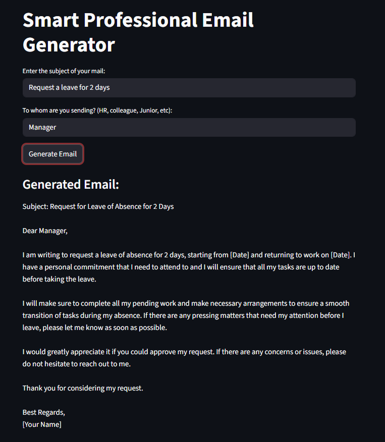

# 📧 Smart Professional Email Generator

An AI-powered professional email generator built with **LangChain + Groq + Streamlit**.
Generate professional emails instantly by just entering the subject and recipient type.

## 🌐 Live Demo
👉 [Try it live here](https://smart-email-generator.streamlit.app)

## 🚀 Demo


## ✨ Features
- Generate professional emails instantly
- Supports different recipient types (HR, Manager, Colleague, Junior, etc)
- Context-aware email body based on subject
- Clean dark themed Streamlit UI
- Powered by Llama 3.3 70B via Groq

## 🛠️ Tech Stack
- **LangChain** - Prompt Templates & Chaining
- **Groq API** - Llama 3.3 70B LLM
- **Streamlit** - Web UI
- **Python** - Backend

## ⚙️ Setup & Installation

### 1. Clone the repository
```bash
git clone https://github.com/bangarukondabollapally/smart-email-generator.git
cd smart-email-generator
```

### 2. Install dependencies
```bash
pip install -r requirements.txt
```

### 3. Create .env file
```bash
cp .env.example .env
```

Add your Groq API key in .env:
GROQ_API_KEY=your_groq_api_key_here

### 4. Run the app
```bash
streamlit run app.py
```

## 🔑 Get Free API Key
Get your free Groq API key at https://console.groq.com

## 📁 Project Structure

```
Smart_Email_Generator/
├── app.py               # Streamlit UI
├── model.py             # LangChain + Groq model logic
├── .env.example         # Environment variables template
├── requirements.txt     # Dependencies
└── README.md            # Project documentation
```
